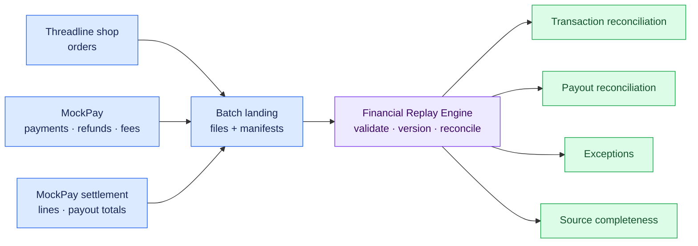

# Threadline Financial Replay Engine — Project Scope

## Purpose

Threadline is a fictional German online clothing retailer. It sells apparel directly to customers in EUR and uses one fictional payment service provider, MockPay.

Threadline receives separate daily reports for orders, payments, refunds, fees, settlement lines, and payouts. Those reports can arrive late, be delivered more than once, contain corrections, or disagree about money. The Financial Replay Engine preserves the evidence, reconciles the reports, and explains every result it can support.

The central business question is:

> Can every euro collected from customers, refunded, charged as a fee, and paid out by MockPay be explained from the available evidence?

## Business consequence

Incorrect reconciliation can cause Threadline to:

- overstate or understate cash expected from MockPay;
- miss duplicate captures or excessive refunds;
- accept incorrect processing fees;
- report a payout as correct while a required report is missing;
- produce different financial results after a retry or historical replay.

## Users

The initial users are finance operations, payment operations, data engineering, analytics engineering, and internal audit.

## MVP operating model

| Decision | MVP contract |
|---|---|
| Store | One German online clothing store |
| Currency | EUR only |
| Payment provider | MockPay |
| Inputs | Daily batch files with manifests |
| Main reconciliation | Once daily after the source deadlines |
| Catch-up | Re-run affected results when late or corrected evidence arrives |
| Payment behavior | Multiple attempts allowed; clean data has at most one successful capture per order |
| Refund behavior | Multiple partial refunds allowed, bounded by the captured amount |
| Fee behavior | One processing fee per successful capture under a versioned fictional fee schedule |
| Payout behavior | Eligible movements are itemized in daily payout batches |
| Storage time | UTC timestamps; business deadlines interpreted in Europe/Berlin |

## System boundary

The project begins when source reports are delivered and ends when reconciliation results and exceptions are published.



## Concrete inputs

The MVP consumes these report types:

1. Orders
2. Payments
3. Refunds
4. Fees
5. Settlement lines
6. Payouts
7. One manifest for every delivered report file

Raw ingestion metadata such as `source_file`, `batch_id`, `received_at_utc`, and `record_hash` is added by the pipeline and retained for audit.

## Concrete outputs

The MVP publishes:

- one transaction-reconciliation result per order and run;
- one payout-reconciliation result per payout and run;
- zero or more independently evaluated exceptions per entity and run;
- one completeness result per expected report type, business date, and run;
- structured quarantine records for invalid source rows.

## Primary correctness claim

For the same accepted source versions, rule versions, and evaluation cutoff:

```text
incremental reconciliation == clean full rebuild
```

Equality covers financial totals, movement allocations, completeness states, and exception states. Operational timestamps and retry counters are excluded.

## MVP non-goals

The following are deferred until the core claim is proven:

- multiple currencies and foreign-exchange conversion;
- chargebacks and disputes;
- split payments and partial captures;
- multiple payment providers;
- bank-statement reconciliation;
- tax accounting and accounting revenue recognition;
- discounts, vouchers, loyalty, and customer-service data;
- negative payout balance carry-forward;
- fuzzy matching;
- machine learning or LLM decisions;
- Kafka or real-time payment processing;
- Snowflake, cloud deployment, and Terraform;
- a customer-facing storefront or React dashboard.

The simulator will generate only dates whose expected daily payout is positive during the MVP. Negative provider balances become a later adversarial extension.

## Stage 1 success criteria

Stage 1 is complete when the project has:

- an unambiguous grain and identity for every dataset;
- explicit money, sign, precision, and rounding rules;
- deterministic duplicate and correction behavior;
- separate business, availability, receipt, and evaluation times;
- explicit definitions for pending, incomplete, reconciled, and exception states;
- falsifiable correctness invariants;
- hand-calculated scenarios covering the principal happy paths and failures.
